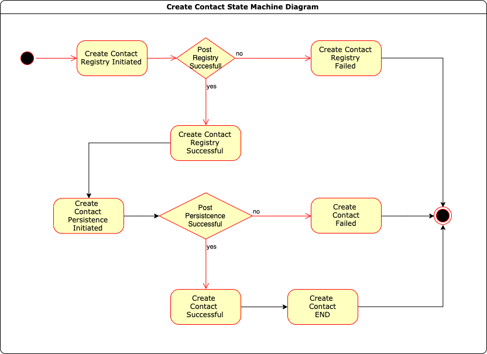
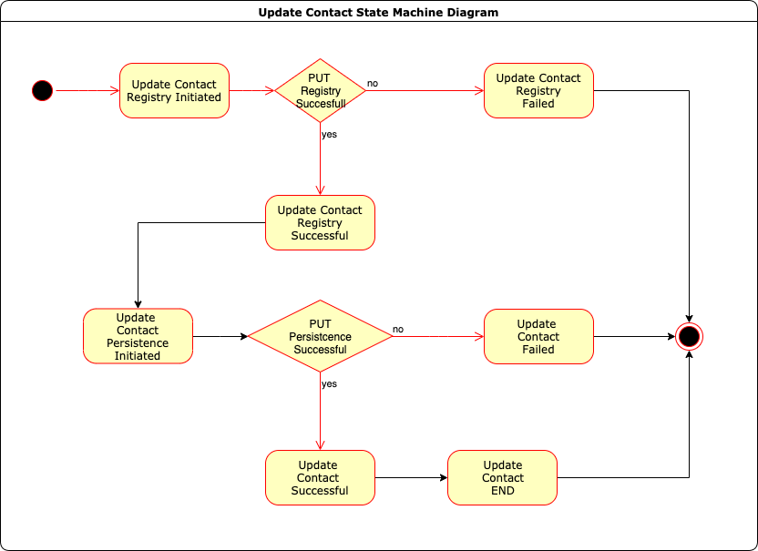
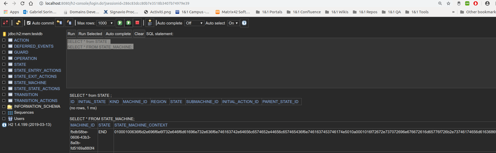

# Contact Service
Modeling a RESTfull API using Finite Statemachine (FSM - https://en.wikipedia.org/wiki/Finite-state_machine ) using Spring Statemachine (SSM) framework https://projects.spring.io/spring-statemachine/. 
Use case: provisioning activities using states and transitions. 
We simulate a contact resource getting provisioned through the internet registry which gets saved/updated/deleted in our internal store. 
## Create Contact 
Here is diagram for the create operation
 

## Update Contact 
Here is diagram for the update operation
 


Here is diagram for the delete operation
 


## Technology

The component uses the following technologies:
- **Java 11** as the main platform
- Spring Boot 2.1 for use of IoC, for ease of configuration through spring-boot-starters and for the reactive support
- Liquibase for database versioning
- PostgreSQL as database / H2 as embedded database
- Spring State Machine 
## Development

The application uses Apache Maven as build tool. It follows the [team's git branching model](http://domdocsbs01.ops.server.lan:7777/docs-domains-registration/Domains-Git-Branching-Model).
Business documentation can be found in docs folder.

## Running locally

The most easiest way is to run the main file from your IDE.

The setup is as follows:
```
$ git clone ssh://git@bitbucket.1and1.org/dr/contact-service.git
$ cd contact-service
$ mvn clean install
$ java -jar target/*.jar or mvn spring-boot:run

$ curl -X POST http://localhost:8080/contacts 
$ curl -X PUT http://localhost:8080/contacts
$ curl -X DELETE http://localhost:8080/contacts
```
Application will be exposed on port 8080 and logs will be available on /logs folder 
File: transitions.log output machine id and state transition information 
File: contact-service.log is application log file 

An H2 in memory database with web console at http://localhost:8080/h2-console passswordless user sa as authentication
 

